<p align="center">
  
  
  
  
  
</p>

<h1 align="center">
  <br>
  
  <br>
  🌿 NutriSense AI
  <br>
</h1>

<h3 align="center">
  <em>Understand What You Eat. Instantly.</em>
</h3>

<p align="center">
  Your AI food intelligence companion. No forms, no filters, no confusion — just clear, honest insights about what's really in your food.
</p>

<p align="center">
  <a href="https://nutrisense-ai-prod.lovable.app/"><strong>🚀 Try Live Demo →</strong></a>
  &nbsp;&nbsp;|&nbsp;&nbsp;
  <a href="#features">Features</a>
  &nbsp;&nbsp;|&nbsp;&nbsp;
  <a href="#how-it-works">How It Works</a>
  &nbsp;&nbsp;|&nbsp;&nbsp;
  <a href="#tech-stack">Tech Stack</a>
  &nbsp;&nbsp;|&nbsp;&nbsp;
  <a href="#getting-started">Get Started</a>
</p>

<br>

<p align="center">
  
</p>

---

## 🎯 The Problem

> **73% of consumers want to understand food labels, but most feel overwhelmed by scientific jargon and conflicting information.**

Ever stood in a grocery aisle, staring at an ingredient list, wondering:

- *"What is Monosodium Glutamate? Is it bad?"*
- *"Why are there so many artificial colors?"*
- *"Is this safe for my kids? During pregnancy?"*

Google gives you 10 contradicting articles. Health apps give you a simple "good/bad" score without context. Neither helps you actually *understand*.

## 💡 The Solution

**NutriSense AI** is an AI-native food intelligence platform that doesn't just analyze ingredients — it *explains* them. Like having a nutritionist friend who:

- ✅ Speaks plain English, not scientific jargon
- ✅ Explains *why* ingredients exist, not just if they're "bad"
- ✅ Admits uncertainty when science is unclear
- ✅ Answers your follow-up questions conversationally

---

## ✨ Features

### 🔍 Multi-Modal Input
Analyze food your way — scan with camera, upload a photo, use voice, or paste ingredients directly.

### 🧠 Transparent AI Reasoning
Watch the AI think in real-time. No black boxes — see exactly how conclusions are reached:
- Reading ingredient list
- Identifying components
- Cross-referencing research
- Analyzing safety profiles
- Evaluating tradeoffs

### 📊 Nuanced Verdicts
Not just "good" or "bad" — get confidence-scored assessments with honest uncertainty:

| Verdict | Meaning |
|---------|---------|
| 🟢 **Generally Safe** | No significant concerns for most people |
| 🟡 **Some Concerns** | Notable ingredients worth understanding |
| 🔴 **Worth Investigating** | Multiple ingredients with documented concerns |

### ⚖️ Tradeoff Transparency
Understand the *why* behind every ingredient:

```
MSG (Monosodium Glutamate)
├── WHY IT'S HERE: Creates addictive umami flavor
├── THE CONCERN: Some report headaches (studies inconclusive)
└── THE REALITY: Naturally in tomatoes, parmesan. Safe for most.
```

### 💬 Conversational Follow-Ups
Ask questions like you're talking to a friend:
- *"Is this safe during pregnancy?"*
- *"What's the worst ingredient here?"*
- *"How does this compare to whole foods?"*

### 📱 Context-Aware Intelligence
Results tailored to your situation — fitness enthusiasts get different insights than parents shopping for toddlers.

---

## 🏗️ How It Works

```mermaid
graph LR
    A[📷 Input] --> B[🧠 AI Processing]
    B --> C[📊 Analysis]
    C --> D[💬 Interaction]
    
    subgraph "Input Methods"
        A1[Camera Scan]
        A2[Image Upload]
        A3[Voice Input]
        A4[Text Paste]
    end
    
    subgraph "AI Reasoning Pipeline"
        B1[Ingredient Parsing]
        B2[Component Identification]
        B3[Research Cross-Reference]
        B4[Safety Profiling]
        B5[Context Analysis]
        B6[Tradeoff Evaluation]
    end
    
    subgraph "Output"
        C1[Verdict + Confidence]
        C2[Ingredient Breakdown]
        C3[Tradeoff Explanations]
    end
    
    subgraph "Conversation"
        D1[Follow-up Q&A]
        D2[Personalized Advice]
    end
```



### System Architecture

```
┌─────────────────────────────────────────────────────────────────┐
│                        NutriSense AI                            │
├─────────────────────────────────────────────────────────────────┤
│                                                                 │
│  ┌──────────────┐     ┌──────────────┐     ┌──────────────┐    │
│  │   Frontend   │     │  AI Engine   │     │  Knowledge   │    │
│  │   (React)    │────▶│  (Claude)    │────▶│    Base      │    │
│  └──────────────┘     └──────────────┘     └──────────────┘    │
│         │                    │                    │             │
│         ▼                    ▼                    ▼             │
│  ┌──────────────┐     ┌──────────────┐     ┌──────────────┐    │
│  │ Multi-Modal  │     │  Reasoning   │     │  Research    │    │
│  │   Input      │     │  Pipeline    │     │   Papers     │    │
│  └──────────────┘     └──────────────┘     └──────────────┘    │
│                                                                 │
└─────────────────────────────────────────────────────────────────┘
```

---

## 🛠️ Tech Stack

| Layer | Technology | Purpose |
|-------|------------|---------|
| **Frontend** | React 18 + TypeScript | UI Components & State |
| **Styling** | Tailwind CSS | Utility-first styling |
| **AI Engine** | Claude (Anthropic) | Natural language understanding |
| **Build** | Vite | Fast development & bundling |
| **Deployment** | Lovable | Instant deployment & hosting |
| **Icons** | Lucide React | Beautiful, consistent icons |

---

## 🚀 Getting Started

### Prerequisites

- Node.js 18+ 
- npm or yarn

### Installation

```bash
# Clone the repository
git clone https://github.com/RahulSinghai606/nutri-ai-co-pilot.git

# Navigate to project directory
cd nutri-ai-co-pilot

# Install dependencies
npm install

# Start development server
npm run dev
```

### Environment Variables

Create a `.env` file in the root directory:

```env
VITE_ANTHROPIC_API_KEY=your_api_key_here
```

### Build for Production

```bash
npm run build
```

---

## 📁 Project Structure

```
nutri-ai-co-pilot/
├── src/
│   ├── components/
│   │   ├── ui/              # Reusable UI components
│   │   ├── Home.tsx         # Landing page
│   │   ├── Analyzing.tsx    # AI thinking animation
│   │   ├── Results.tsx      # Analysis results
│   │   └── ChatPanel.tsx    # Conversational Q&A
│   ├── hooks/
│   │   └── useAnalysis.ts   # Analysis state management
│   ├── lib/
│   │   ├── ai.ts            # AI integration
│   │   └── ingredients.ts   # Ingredient database
│   ├── types/
│   │   └── index.ts         # TypeScript definitions
│   ├── App.tsx              # Main application
│   └── main.tsx             # Entry point
├── public/
│   └── logo.svg             # App logo
├── docs/
│   └── demo.gif             # Demo animation
└── README.md
```

---

## 🎨 Design Philosophy

### "Organic Intelligence"

NutriSense embodies a design language we call **Organic Intelligence** — where AI meets natural, human-centered design:

| Principle | Implementation |
|-----------|----------------|
| **Warmth** | Stone/Emerald/Amber palette, soft shadows |
| **Transparency** | Visible AI reasoning, confidence meters |
| **Clarity** | Plain language, minimal jargon |
| **Trust** | Honest uncertainty, source attribution |

### Color System

```css
/* Primary */
--emerald-600: #059669    /* Actions, positive */
--stone-800: #1c1917      /* Text, headings */

/* Semantic */
--green: #10b981          /* Safe */
--amber: #f59e0b          /* Moderate concern */
--rose: #ef4444           /* Significant concern */

/* Backgrounds */
--stone-50: #fafaf9       /* Base */
--emerald-50: #ecfdf5     /* Gradient accent */
```

---

## 📈 Roadmap

- [x] Core analysis engine
- [x] Multi-modal input (demo)
- [x] Conversational Q&A
- [x] Tradeoff explanations
- [ ] Real camera scanning (OCR)
- [ ] Voice input integration
- [ ] User profiles & history
- [ ] API for third-party apps
- [ ] Browser extension
- [ ] Mobile app (React Native)

---

## 🤝 Contributing

We welcome contributions! Please see our [Contributing Guide](CONTRIBUTING.md) for details.

```bash
# Fork the repo
# Create your feature branch
git checkout -b feature/amazing-feature

# Commit your changes
git commit -m 'Add amazing feature'

# Push to the branch
git push origin feature/amazing-feature

# Open a Pull Request
```

---

## 📄 License

This project is licensed under the MIT License — see the [LICENSE](LICENSE) file for details.

---

## 👥 Team

<table>
  <tr>
    <td align="center">
      <a href="https://github.com/RahulSinghai606">
        
        <br />
        <sub><b>Rahul Singhai</b></sub>
      </a>
      <br />
      <sub>GenAI Developer</sub>
    </td>
  </tr>
</table>

---

## 🙏 Acknowledgments

- [Anthropic](https://anthropic.com) for Claude AI
- [Lovable](https://lovable.dev) for instant deployment
- [Tailwind CSS](https://tailwindcss.com) for styling
- [Lucide](https://lucide.dev) for icons

---

<br>

<p align="center">
  
</p>

<h3 align="center">
  🏆 Built for EnCode 2026 Hackathon @ IIT Guwahati
</h3>

<p align="center">
  <em>AI-Native Applications Track</em>
  <br>
  <em>January 2026</em>
</p>

<p align="center">
  <strong>Theme:</strong> AI-Native, Not AI-Added
  <br>
  Building applications where AI <em>is</em> the interface — doing the cognitive work so users don't have to.
</p>

---

<p align="center">
  <a href="https://nutrisense-ai-prod.lovable.app/">
    
  </a>
</p>

<p align="center">
  Made with 🌿 by Team NutriSense
</p>
