<p align="center">
  
  
  
  
  
  
</p>

<h1 align="center">
  <br>
  🌿 NutriSense AI
  <br>
</h1>

<h3 align="center">
  <em>Understand What You Eat. Instantly.</em>
</h3>

<p align="center">
  Your AI food intelligence companion. No forms, no filters, no confusion — just clear, honest insights about what's really in your food.
</p>

<p align="center">
  <a href="https://nutrisense-ai-prod.lovable.app/"><strong>🚀 Try Live Demo →</strong></a>
  &nbsp;&nbsp;|&nbsp;&nbsp;
  <a href="#-features">Features</a>
  &nbsp;&nbsp;|&nbsp;&nbsp;
  <a href="#-how-it-works">How It Works</a>
  &nbsp;&nbsp;|&nbsp;&nbsp;
  <a href="#%EF%B8%8F-tech-stack">Tech Stack</a>
  &nbsp;&nbsp;|&nbsp;&nbsp;
  <a href="#-getting-started">Get Started</a>
</p>

<br>

<p align="center">
  <a href="https://nutrisense-ai-prod.lovable.app/">
    
  </a>
</p>

---

## 🎯 The Problem

> **73% of consumers want to understand food labels, but most feel overwhelmed by scientific jargon and conflicting information.**

Ever stood in a grocery aisle, staring at an ingredient list, wondering:

- *"What is Monosodium Glutamate? Is it bad?"*
- *"Why are there so many artificial colors?"*
- *"Is this safe for my kids? During pregnancy?"*

Google gives you 10 contradicting articles. Health apps give you a simple "good/bad" score without context. Neither helps you actually *understand*.

## 💡 The Solution

**NutriSense AI** is an AI-native food intelligence platform that doesn't just analyze ingredients — it *explains* them. Like having a nutritionist friend who:

- ✅ Speaks plain English, not scientific jargon
- ✅ Explains *why* ingredients exist, not just if they're "bad"
- ✅ Admits uncertainty when science is unclear
- ✅ Answers your follow-up questions conversationally

---

## ✨ Features

<table>
  <tr>
    <td width="50%">
      <h3>🔍 Multi-Modal Input</h3>
      <p>Analyze food your way — scan with camera, upload a photo, use voice, or paste ingredients directly.</p>
    </td>
    <td width="50%">
      <h3>🧠 Transparent AI Reasoning</h3>
      <p>Watch the AI think in real-time. No black boxes — see exactly how conclusions are reached.</p>
    </td>
  </tr>
  <tr>
    <td width="50%">
      <h3>📊 Nuanced Verdicts</h3>
      <p>Not just "good" or "bad" — get confidence-scored assessments with honest uncertainty.</p>
    </td>
    <td width="50%">
      <h3>💬 Conversational Follow-Ups</h3>
      <p>Ask questions like you're talking to a friend. Get context-aware, personalized answers.</p>
    </td>
  </tr>
</table>

### 🧠 Transparent AI Reasoning Process

Watch the AI think in real-time:
```
✓ Reading ingredient list...
✓ Identifying components...
✓ Cross-referencing health research...
✓ Analyzing safety profiles...
✓ Considering nutritional context...
✓ Evaluating tradeoffs...
✓ Formulating insights...
```

### 📊 Nuanced Verdict System

| Verdict | Confidence | Meaning |
|---------|------------|---------|
| 🟢 **Generally Safe** | 80-100% | No significant concerns for most people |
| 🟡 **Some Concerns** | 50-79% | Notable ingredients worth understanding |
| 🔴 **Worth Investigating** | <50% | Multiple ingredients with documented concerns |

### ⚖️ Tradeoff Transparency

Understand the *why* behind every ingredient:

```
MSG (Monosodium Glutamate)
├── WHY IT'S HERE: Creates addictive umami flavor
├── THE CONCERN: Some report headaches (studies inconclusive)
└── THE REALITY: Naturally in tomatoes, parmesan. Safe for most.
```

### 💬 Conversational AI

Ask questions like you're talking to a friend:
- *"Is this safe during pregnancy?"*
- *"What's the worst ingredient here?"*
- *"How does this compare to whole foods?"*
- *"Is this okay for my toddler?"*

---

## 🏗️ How It Works

### System Architecture

```
┌─────────────────────────────────────────────────────────────────────────┐
│                          NutriSense AI                                  │
├─────────────────────────────────────────────────────────────────────────┤
│                                                                         │
│  ┌──────────────┐     ┌──────────────────┐     ┌──────────────┐        │
│  │   Frontend   │     │    AI Engine     │     │  Knowledge   │        │
│  │   (React)    │────▶│ (Gemini Flash)   │────▶│    Base      │        │
│  └──────────────┘     └──────────────────┘     └──────────────┘        │
│         │                      │                      │                 │
│         ▼                      ▼                      ▼                 │
│  ┌──────────────┐     ┌──────────────────┐     ┌──────────────┐        │
│  │ Multi-Modal  │     │    Reasoning     │     │  Research    │        │
│  │   Input      │     │    Pipeline      │     │   Papers     │        │
│  └──────────────┘     └──────────────────┘     └──────────────┘        │
│                                                                         │
└─────────────────────────────────────────────────────────────────────────┘
```

### Data Flow

```mermaid
graph LR
    A[📷 Input] --> B[🧠 Gemini Flash AI]
    B --> C[📊 Analysis]
    C --> D[💬 Interaction]
    
    subgraph Input
        A1[Camera] --> A
        A2[Upload] --> A
        A3[Voice] --> A
        A4[Text] --> A
    end
    
    subgraph Processing
        B --> B1[Parse Ingredients]
        B1 --> B2[Identify Components]
        B2 --> B3[Cross-Reference Research]
        B3 --> B4[Safety Profiling]
        B4 --> B5[Tradeoff Evaluation]
    end
    
    subgraph Output
        C --> C1[Verdict + Confidence]
        C --> C2[Ingredient Breakdown]
        C --> C3[Tradeoff Explanations]
    end
```



---

## 🛠️ Tech Stack

| Layer | Technology | Purpose |
|-------|------------|---------|
| **Frontend** | React 18 + TypeScript | UI Components & State Management |
| **Styling** | Tailwind CSS + shadcn/ui | Utility-first styling & components |
| **AI Engine** | Google Gemini Flash 2.0 | Natural language understanding & reasoning |
| **Backend** | Supabase | Database & Authentication |
| **Build** | Vite | Fast development & bundling |
| **Deployment** | Lovable | Instant deployment & hosting |
| **Icons** | Lucide React | Beautiful, consistent iconography |

### Why Gemini Flash?

- ⚡ **Ultra-fast inference** — Sub-second response times for real-time analysis
- 🧠 **Strong reasoning** — Excellent at nuanced nutritional analysis
- 💰 **Cost-effective** — Enables sustainable free tier for users
- 🔄 **Multimodal** — Native support for image + text input

---

## 🚀 Getting Started

### Prerequisites

- Node.js 18+ 
- npm or bun
- Google AI API Key (Gemini)

### Installation

```bash
# Clone the repository
git clone https://github.com/RahulSinghai606/nutri-ai-co-pilot.git

# Navigate to project directory
cd nutri-ai-co-pilot

# Install dependencies
npm install
# or
bun install

# Start development server
npm run dev
# or
bun dev
```

### Environment Variables

Create a `.env` file in the root directory:

```env
# Google Gemini AI
VITE_GOOGLE_AI_API_KEY=your_gemini_api_key_here

# Supabase (optional)
VITE_SUPABASE_URL=your_supabase_url
VITE_SUPABASE_ANON_KEY=your_supabase_anon_key
```

### Build for Production

```bash
npm run build
# or
bun run build
```

---

## 📁 Project Structure

```
nutri-ai-co-pilot/
├── public/
│   └── ...                  # Static assets
├── src/
│   ├── components/
│   │   ├── ui/              # shadcn/ui components
│   │   ├── Header.tsx       # Navigation header
│   │   ├── Hero.tsx         # Landing hero section
│   │   ├── InputSection.tsx # Multi-modal input
│   │   ├── AnalysisView.tsx # AI thinking animation
│   │   ├── ResultsView.tsx  # Analysis results
│   │   └── ChatPanel.tsx    # Conversational Q&A
│   ├── hooks/
│   │   └── useAnalysis.ts   # Analysis state management
│   ├── lib/
│   │   ├── gemini.ts        # Gemini AI integration
│   │   ├── utils.ts         # Utility functions
│   │   └── ingredients.ts   # Ingredient database
│   ├── types/
│   │   └── index.ts         # TypeScript definitions
│   ├── App.tsx              # Main application
│   ├── main.tsx             # Entry point
│   └── index.css            # Global styles
├── supabase/
│   └── ...                  # Supabase configuration
├── .env                     # Environment variables
├── tailwind.config.ts       # Tailwind configuration
├── vite.config.ts           # Vite configuration
└── package.json             # Dependencies
```

---

## 🎨 Design Philosophy

### "Organic Intelligence"

NutriSense embodies a design language we call **Organic Intelligence** — where AI meets natural, human-centered design:

| Principle | Implementation |
|-----------|----------------|
| **Warmth** | Stone/Emerald/Amber palette, soft shadows |
| **Transparency** | Visible AI reasoning, confidence meters |
| **Clarity** | Plain language, minimal jargon |
| **Trust** | Honest uncertainty, source attribution |

### Color System

```css
/* Primary Actions */
--emerald-600: #059669    /* Buttons, positive indicators */
--emerald-500: #10b981    /* Safe status */

/* Text */
--stone-800: #1c1917      /* Headings */
--stone-600: #57534e      /* Body text */

/* Semantic Status */
--amber-500: #f59e0b      /* Moderate concern */
--rose-500: #ef4444       /* Significant concern */

/* Backgrounds */
--stone-50: #fafaf9       /* Base background */
--emerald-50: #ecfdf5     /* Accent sections */
```

---

## 📈 Roadmap

- [x] ✅ Core analysis engine with Gemini Flash
- [x] ✅ Multi-modal input interface (demo)
- [x] ✅ Conversational Q&A system
- [x] ✅ Tradeoff explanations
- [x] ✅ Responsive mobile design
- [ ] 🔄 Real camera scanning (OCR integration)
- [ ] 🔄 Voice input integration
- [ ] 📋 User profiles & history
- [ ] 📋 API for third-party apps
- [ ] 📋 Browser extension
- [ ] 📋 Mobile app (React Native)

---

## 🤝 Contributing

We welcome contributions! Here's how you can help:

```bash
# Fork the repo
# Create your feature branch
git checkout -b feature/amazing-feature

# Commit your changes
git commit -m 'Add amazing feature'

# Push to the branch
git push origin feature/amazing-feature

# Open a Pull Request
```

### Development Guidelines

- Follow the existing code style (TypeScript, Tailwind)
- Write meaningful commit messages
- Add tests for new features
- Update documentation as needed

---

## 📄 License

This project is licensed under the MIT License — see the [LICENSE](LICENSE) file for details.

---

## 👥 Team

<table>
  <tr>
    <td align="center">
      <a href="https://github.com/RahulSinghai606">
        
        <br />
        <sub><b>Rahul Singhai</b></sub>
      </a>
      <br />
      <sub>GenAI Developer @ Kellton Tech</sub>
      <br />
      <sub>MBA Business Analytics @ Chandigarh University</sub>
    </td>
  </tr>
</table>

---

## 🙏 Acknowledgments

- [Google](https://ai.google.dev/) for Gemini Flash AI
- [Lovable](https://lovable.dev) for instant deployment
- [Tailwind CSS](https://tailwindcss.com) for utility-first styling
- [shadcn/ui](https://ui.shadcn.com) for beautiful components
- [Lucide](https://lucide.dev) for icons
- [Supabase](https://supabase.com) for backend infrastructure

---

## 📊 Project Stats


---

<br>

<p align="center">
  
  
</p>

<h2 align="center">
  🏆 Built for EnCode 2026 Hackathon
</h2>

<h3 align="center">
  Indian Institute of Technology, Guwahati
</h3>

<p align="center">
  <em>AI-Native Applications Track</em>
  <br>
  <em>January 4-5, 2026</em>
</p>

<br>

<table align="center">
  <tr>
    <td align="center"><strong>🎯 Theme</strong></td>
    <td>AI-Native, Not AI-Added</td>
  </tr>
  <tr>
    <td align="center"><strong>💡 Philosophy</strong></td>
    <td>Building applications where AI <em>is</em> the interface</td>
  </tr>
  <tr>
    <td align="center"><strong>🧠 Core Principle</strong></td>
    <td>AI does the cognitive work so users don't have to</td>
  </tr>
</table>

<br>

<p align="center">
  <strong>Judging Criteria Addressed:</strong>
</p>

<table align="center">
  <tr>
    <th>Criteria</th>
    <th>Weight</th>
    <th>How NutriSense Delivers</th>
  </tr>
  <tr>
    <td>AI-Native Experience</td>
    <td>50%</td>
    <td>Multi-modal input, conversational Q&A, AI IS the interface</td>
  </tr>
  <tr>
    <td>Reasoning & Explainability</td>
    <td>30%</td>
    <td>Visible thinking, confidence meters, tradeoff explanations</td>
  </tr>
  <tr>
    <td>Technical Execution</td>
    <td>20%</td>
    <td>Clean code, responsive design, production deployment</td>
  </tr>
</table>

---

<p align="center">
  <a href="https://nutrisense-ai-prod.lovable.app/">
    
  </a>
</p>

<p align="center">
  <sub>Made with 🌿 and ☕ by Team NutriSense</sub>
</p>

<p align="center">
  <sub>© 2026 NutriSense AI. All rights reserved.</sub>
</p>
